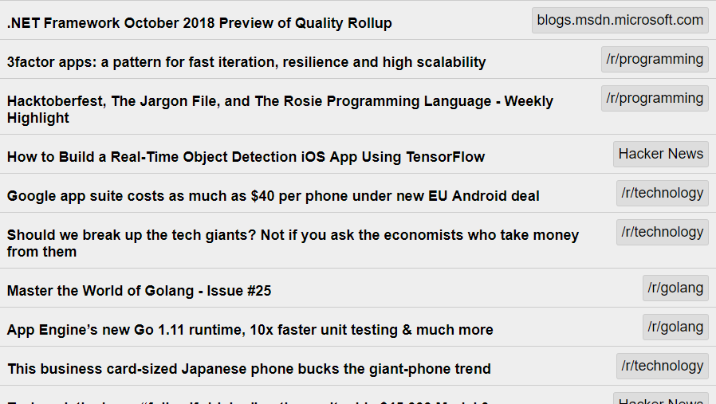

[](LICENSE) [](https://goreportcard.com/report/github.com/ww9/news)

### 📰 News
News is a minimalist RSS/Atom aggregator that saves to HTML files.
```
📂news
  ├📰 index.html
  ├📰 page2.html
  └📰 page3.html
```

That's it! No database, no configuration files, no HTTP server, no ads, no tracking and no JavaScript. Everything is stored in the HTML files which look like this:



### Usage

Running `news` creates `📂news` directory containing a sample `📰index.html` file which you should edit with your own RSS/Atom feed sources.

Every 10 minutes it fetches news from your feeds and saves what's fresh to `📰index.html`.

When `📰index.html` grows large (1000 items by default), the oldest 500 items are moved to `📰page2.html`.

`📂news` can reside in Google Drive or Dropbox for easy access everywhere. This is how I use it:


### Command-line arguments
`news -h` prints:
```
-d string	directory to save html files in. "./news" is used by default and created if necessary
-i int		minutes to wait between updates (default 10)
-n int		number of items per .html file. A new page.html file is created whenever 
		index.html contains 2x that number (default 500)
-t int		timeout in seconds when fetching feeds (default 10)
-c string	optional custom Go html/template file to to use when generating .html files. 
		See `news/feed/template.go` in source for an example
-v    		verbose mode outputs extra info when enabled
```

### Running from code
`go get -u http://github.com/ww9/news`

`cd $GOROOT/src/github.com/ww9/news`

`go get ./...` to fetch dependencies

`go run main.go`

### Installing from code
`go install -i github.com/ww9/news`

If you have Go's `/bin` directory in `$PATH` env variable, you should be able to run `news` from anywhere.

### Downloading binaries
Windows, Linux and OSX binaries are available in [Releases](https://github.com/ww9/news/releases).

### License

Dedicated to [Public Domain](https://gist.github.com/ww9/4c4481fb7b55186960a34266078c88b1). Do whatever you want with it, including changing the license of a copy and omitting the author.