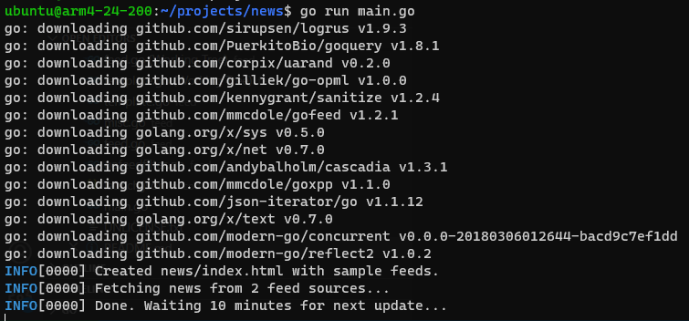

[](https://opensource.org/license/mit/) [](https://goreportcard.com/report/github.com/ww9/news)

# 📰 News

News is a minimalist RSS/Atom aggregator that saves to HTML files.

```
📂news
  ├📰 index.html
  ├📰 page2.html
  └📰 page3.html
```

That's it! No database, no configuration files, no HTTP server, no ads, no tracking and no JavaScript. Everything is stored in the HTML files which look like this:


## Usage

Running `news` creates `📂news` directory containing a sample `📰index.html` file which you should edit with your own RSS/Atom feed sources.

Every 10 minutes it fetches news from your feeds and saves what's fresh to `📰index.html`.

When `📰index.html` grows large (1000 items by default), the oldest 500 items are moved to `📰page2.html`.

`📂news` can reside in Google Drive or Dropbox for easy access everywhere.

This is how I use it:

```bash
news -wait 30 -dir "/mnt/d/gdrive/news"
```

## Command-line arguments

`news -h` prints:

```
  -dir string
        directory to store html files. By default ./news is used and created if necessary
  -items int
        number of items per page.html file. A new page.html file is created whenever index.html contains 2x that number (default 500)
  -noflood int
        minium seconds between calls to same domain to avoid flooding (default 30)
  -opml string
        path to OPML file containing feed URLS to be imported. Existing feed URLs are ovewritten, not duplicated
  -template news/feed/template.go
        custom Go html/template file to use when generating .html files. See news/feed/template.go
  -timeout int
        timeout in seconds when fetching feeds (default 10)
  -verbose
        verbose mode outputs extra info when enabled
  -wait int
        minutes to wait between updates (default 10)
```

## Running from source

`git clone https://github.com/ww9/news`

`cd news`

`go run main`



## Downloading binaries

Windows, Linux and OSX binaries are available in [Releases](https://github.com/ww9/news/releases).

## How to build releases

Install Taskfile (https://taskfile.dev/installation/). I did it like this:

`sh -c "$(curl --location https://taskfile.dev/install.sh)" -- -d -b ~/.local/bin`

Then run `task release` to build binaries for Windows, Linux and OSX in a directory called `release`.

## Todo

It works great but we can always improve! Here are some ideas:

- [ ] Parallelize feed fetching
- [ ] Replace logrus with std log
- [ ] More tests
- [ ] Vendor
- [ ] Dockerfile
- [ ] Serve over HTTP if started with `-http` flag
- [ ] Colorize HTML lines based on retrieval age. So we know just be looking what is new.
- [ ] Put retrieval date in tooltip.
- [ ] Move `<style>` bellow body so important and editable info stays at the top of index.html
- [ ] Add this repository to the bottom of the page.